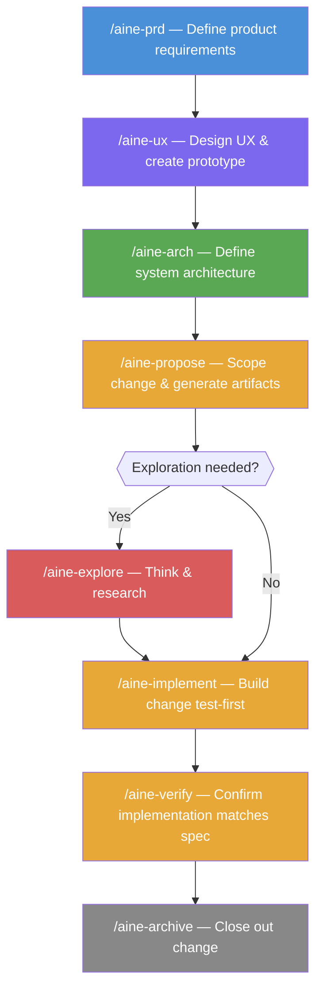

# AINE Team — GitHub Copilot Agent Plugin

AINE Team is a GitHub Copilot Agent Plugin that brings a full software-development team into your editor. It provides four specialized agents and eight skills that collaborate through a **Specification-Driven Development (SDD)** workflow: ideas are captured in structured documents first, then implemented from those documents.

---

## Requirements

- **VS Code** 1.99 or later
- **GitHub Copilot** subscription with Agent mode enabled

---

## Installation

Agent Plugins are installed directly from a GitHub repository. No marketplace listing or extension file is required.

1. Open VS Code and make sure the **GitHub Copilot** extension is installed and signed in.
2. Open the Command Palette (`Cmd+Shift+P` / `Ctrl+Shift+P`) and run:
   ```
   GitHub Copilot: Install Chat Extension from GitHub
   ```
3. Enter the repository path when prompted:
   ```
   github/aine-team-copilot-plugin
   ```
4. VS Code will fetch `plugins/aine-team/.github/plugin/plugin.json` and install the plugin automatically.

> **Manual installation (local build):** Clone this repository, run `npm run build`, then install from the generated `plugins/aine-team/.github/plugin/plugin.json` using the same command above and point to the local path.

After installation, the agents and skills are immediately available in the Copilot Chat panel.

---

## Agents

Switch to an agent by typing `@agent-name` in the Copilot Chat panel.

| Agent | Handle | Role |
|---|---|---|
| Product Manager | `@pm` | PRD creation, requirements discovery, stakeholder alignment |
| System Architect | `@architect` | Architecture documentation, system design, trade-off analysis |
| Senior Software Engineer | `@dev` | TDD implementation, code review, story execution |
| Design Studio | `@ux-designer` | UX brainstorming, design decisions, HTML/CSS prototyping |

Each agent is a collaborative peer — it asks questions, presents options, and waits for your confirmation before proceeding.

---

## Skills (Slash Commands)

Skills are invoked as slash commands inside any agent conversation.

### Global project documents

These commands create or update the shared documents that all agents use as context.

| Command | Description | Output |
|---|---|---|
| `/aine-prd` | Create or update the Product Requirements Document | `aine-docs/prd.md` |
| `/aine-ux` | Create or update the UX design document and HTML prototype | `aine-docs/ux.md`, `aine-docs/prototype-*.html` |
| `/aine-arch` | Create or update the architecture document | `aine-docs/architecture.md` |

### Change lifecycle

A *change* is a named, scoped unit of work (a feature, bug fix, or improvement). Changes live in `aine-docs/changes/<name>/`.

| Command | Description |
|---|---|
| `/aine-propose <name>` | Propose a change — creates `proposal.md`, `design.md`, and `tasks.md`, and updates global docs |
| `/aine-explore [topic]` | Enter explore mode for open-ended thinking; no code is written |
| `/aine-implement [name]` | Implement the tasks for a change using TDD |
| `/aine-verify [name]` | Verify that the implementation matches the change artifacts |
| `/aine-archive [name]` | Archive a completed and verified change |

---

## SDD Workflow

The standard end-to-end workflow is:



```
1. /aine-prd          → Define what the product does and why
2. /aine-ux           → Define the user experience and create a prototype
3. /aine-arch         → Define how the system is built
4. /aine-propose      → Scope a change and generate implementation artifacts
5. /aine-implement    → Build the change test-first
6. /aine-verify       → Confirm the implementation matches the spec
7. /aine-archive      → Close out the change
```

You do not need to run every step for every change. For small changes, `/aine-propose` followed by `/aine-implement` is often sufficient. For exploratory work, start with `/aine-explore`.

### Document structure

All AINE documents are stored in an `aine-docs/` directory at the root of your project:

```
aine-docs/
├── prd.md                    # Product Requirements Document
├── ux.md                     # UX design document
├── architecture.md           # Architecture document
├── prototype-<project>.html  # Interactive HTML prototype
└── changes/
    ├── <change-name>/
    │   ├── proposal.md       # What & why
    │   ├── design.md         # How
    │   └── tasks.md          # Implementation steps
    └── archive/              # Completed changes
```

---

## Project Structure

```
aine-team-copilot-plugin/
├── src/aine-team/            # Plugin source files
│   ├── plugin.json           # Plugin manifest (source)
│   ├── agents/               # Agent definitions (.agent.md)
│   ├── prompts/              # Skill prompts (.prompt.md)
│   └── templates/            # Document templates
├── plugins/aine-team/        # Built plugin output (committed)
│   ├── .github/plugin/
│   │   └── plugin.json       # Final plugin manifest
│   ├── agents/
│   ├── skills/
│   └── templates/
└── scripts/                  # Build and validation scripts
```

Source files live in `src/`. The `plugins/` directory contains the materialized output generated by `npm run build`.

---

## Development

### Build

```bash
npm install
npm run build
```

The build script:
- Copies agents, skills, and templates from `src/aine-team/` into `plugins/aine-team/`
- Converts `.prompt.md` files into skill `SKILL.md` files
- Places the final `plugin.json` at `plugins/aine-team/.github/plugin/plugin.json`

### Validate

```bash
npm run plugin:validate
```

Validates that all paths referenced in `plugin.json` point to existing files.

---

## VS Code Documentation

For more information on Agent Plugins, see the official VS Code documentation:  
https://code.visualstudio.com/docs/copilot/customization/agent-plugins
