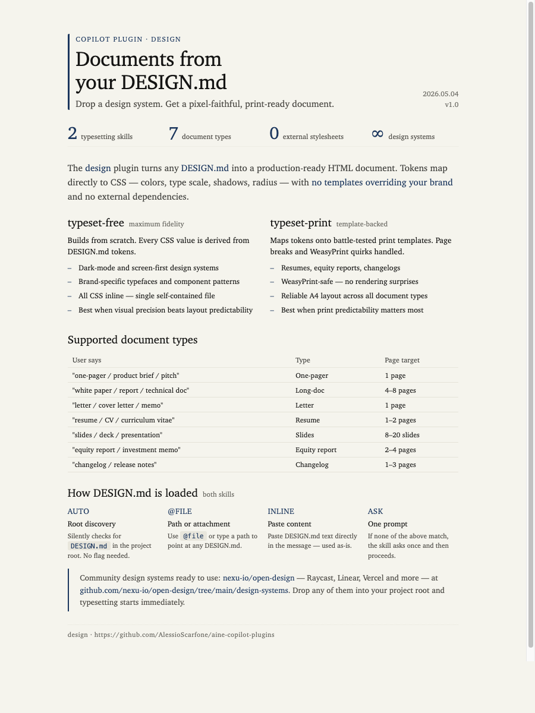

# design



DESIGN.md-driven document typesetting for Latin-script languages. Provide any [DESIGN.md](https://designmd.ai/what-is-design-md) file and produce professional print documents — one-pagers, resumes, letters, reports, and slide decks — styled to your design system.

Supports English, Italian, Spanish, French, German, Portuguese, Dutch, Polish, and other Latin-script languages. Does not support CJK scripts.

---

## Skills

### `typeset-free`

Generates a fully self-contained HTML document from scratch using the DESIGN.md tokens. No pre-built templates — every CSS value comes from the design system. Maximum fidelity to any design system, including brand-specific typefaces, layout grids, and component patterns.

**Use when**: design fidelity matters more than print-layout predictability, or when the design system uses dark backgrounds / screen-first aesthetics.

**Triggers**: "typeset this", "design a document", "make a one-pager with my design system", "use my DESIGN.md", "generate a styled doc"

**Document types**: one-pager, resume, letter, long-doc, slides

---

### `typeset-print`

Overlays a DESIGN.md design system onto bundled print templates. Maps DESIGN.md color, typography, and spacing tokens to template CSS variables, then fills the chosen template with your content. The template handles print-safety (page breaks, WeasyPrint quirks, density); your design system provides the visual identity.

**Use when**: predictable print output is the priority, or the document type maps directly to a bundled template (resume, equity report, changelog).

**Triggers**: "typeset this document", "apply my DESIGN.md to a document template", "use a print template with my design"

**Document types**: one-pager, resume, letter, long-doc, slides, equity-report, changelog

---

## How DESIGN.md is loaded (both skills)

The skills resolve the design system automatically — no flag needed:

1. **Auto-discovery** — looks for `DESIGN.md` in the project root silently
2. **File path** — use `@file` or type the path in the prompt
3. **Inline paste** — paste DESIGN.md content directly in the message
4. **Ask** — if none of the above, the skill asks once

Community design systems: [nexu-io/open-design](https://github.com/nexu-io/open-design/tree/main/design-systems) · [designmd.ai/explore](https://designmd.ai/explore)

---

## Scripts

### `scripts/build.mjs`

```bash
node scripts/build.mjs --html  output.html   # placeholder + structure check
node scripts/build.mjs --pdf   output.html   # WeasyPrint → output.pdf + metadata
node scripts/build.mjs --check output.html   # palette anti-pattern scan
```

PDF metadata (`/Author`, `/Producer`, `/Creator`) is set from `DESIGN_AUTHOR` env var or `git config user.name`. Requires [WeasyPrint](https://weasyprint.org) for PDF export.
