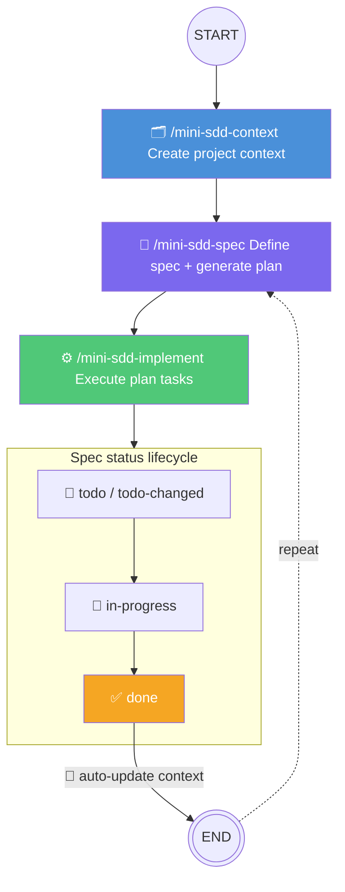

# mini-sdd

A minimal spec-driven development framework for GitHub Copilot. Three skills, one workflow: define context, write specs, implement features.

## Quick Start

1. Switch to the **mini-sdd** agent in VS Code's agent selector.
2. Run the skills as slash commands:

```
/mini-sdd-context          # 1. Set up project context
/mini-sdd-spec <feature>   # 2. Write a feature spec + generate the plan
/mini-sdd-implement <spec> # 3. Execute the plan
```

## Agent

### `mini-sdd` — Spec-Driven Developer

A custom agent that guides you through the mini-SDD workflow. It automatically checks the project state (context file, existing specs and their statuses) and suggests the appropriate next step.

**Behavior:**
- Routes your requests to the right skill
- Checks whether `context.md` exists before allowing spec creation
- Tracks spec statuses and recommends what to implement next
- Enforces the "specs before code" principle — redirects if you try to code without a spec

Select it from the agent picker in VS Code to get the full guided experience.

## Skills

### `/mini-sdd-context` — Project Context

Creates or updates `specs/context.md`, the single source of truth that all other skills read for background on the project.

**What it captures:**
- Product description and purpose
- Architecture style and components
- Tech stack (languages, frameworks, databases, tooling)
- Non-functional requirements

**When to use:**
- First time setting up mini-SDD on a project
- After completing a feature that changes the architecture or stack
- When onboarding AI agents to a codebase

The skill inspects the codebase automatically, then asks targeted questions to fill in gaps.

---

### `/mini-sdd-spec` — Feature Spec

Creates or updates a feature spec inside `specs/<spec-name>/`. Each spec lives in its own folder with two files: `spec.md` (the requirement contract) and `plan.md` (the implementation checklist).

**What it captures:**
- Summary of the feature
- Target user
- Scenarios (GIVEN/WHEN/THEN format)
- Acceptance criteria
- Dependencies

**What it produces:**
- `spec.md` — filled from `spec.template.md`; the human-readable contract, never modified during implementation
- `plan.md` — filled from `plan.template.md`; approach, trade-offs, ordered task checklist with AC tags and **Done when:** checks

**When to use:**
- Defining a new feature or requirement
- Refining or updating an existing spec

**Status lifecycle:**

| Status | Set by | Meaning |
|--------|--------|---------|
| `todo` | `mini-sdd-spec` | Spec and plan just created |
| `todo-changed` | `mini-sdd-spec` | Spec updated; new tasks appended to existing `plan.md` |
| `in-progress` | `mini-sdd-implement` | Implementation started |
| `done` | `mini-sdd-implement` | Implementation completed |

If a spec already exists, the skill asks whether to update it (status → `todo-changed`, new tasks **appended** to `plan.md` without losing history) or create a new spec with a different name.

---

### `/mini-sdd-implement` — Implement

Executes the task list in `plan.md` for a given spec. Does **not** generate tasks — that is done by `/mini-sdd-spec`.

**What it does:**
1. Reads tasks from `plan.md` and executes them one by one
2. Marks each task complete in `plan.md` as it goes (`- [ ]` → `- [x]`)
3. Supports resuming across sessions — picks up from the first unchecked task in any `## Tasks` section
4. Checks off acceptance criteria in `spec.md` on completion
5. Appends a **Development Notes** section to `spec.md` summarising files changed and follow-ups
6. Sets spec status: `in-progress` when work starts, `done` on completion
7. Auto-updates `context.md` to reflect any architecture or stack changes

**Task lifecycle:**
- On first run (`todo` / `todo-changed`): reads tasks from `plan.md`, starts implementing
- On resume (`in-progress`): finds first unchecked task across all `## Tasks` sections, continues
- If `plan.md` has no tasks: blocks and asks you to run `/mini-sdd-spec` first

**Input:** Spec name (e.g., `/mini-sdd-implement user-auth`). If omitted, lists available specs with `todo`, `todo-changed`, or `in-progress` status.

---

## Standard Workflow



1. **Initialize context** — Run `/mini-sdd-context` to capture the project's foundation.
2. **Spec a feature** — Run `/mini-sdd-spec <feature>` to define the requirement and generate a `plan.md` with ordered tasks.
3. **Implement** — Run `/mini-sdd-implement <spec-name>` to execute the tasks in `plan.md`.
4. **Context auto-updated** — On completion, `context.md` is updated and development notes are appended to `spec.md`.
5. **Repeat** for the next feature.

## Configuration

Paths are configurable via `config.json`:

- `ARTIFACT_MAIN_FOLDER` — where `context.md` is written
- `SPECS_SUBFOLDER` — where spec folders are created (default: `specs`). It is a subfolder under `ARTIFACT_MAIN_FOLDER`.

```
{ARTIFACT_MAIN_FOLDER}/
├── context.md                          # Project context (created by mini-sdd-context)
└── {SPECS_SUBFOLDER}/                  # Feature specs (created by mini-sdd-spec)
    └── <spec-name>/
        ├── spec.md                     # Requirement contract (never modified during implementation)
        └── plan.md                     # Approach, trade-offs, task checklist
```

## File Structure (after use)

```
your-project/
└── mini-sdd/
    ├── context.md
    └── specs/
        ├── user-authentication/
        │   ├── spec.md     # Requirement contract
        │   └── plan.md     # Task checklist + dev notes after completion
        └── csv-export/
            ├── spec.md
            └── plan.md
```

