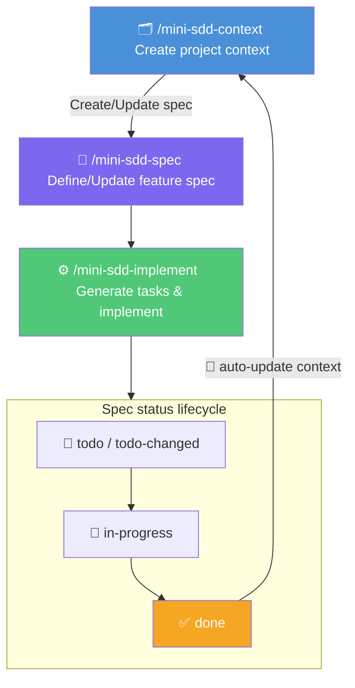

# mini-sdd

A minimal spec-driven development framework for GitHub Copilot. Three skills, one workflow: define context, write specs, implement features.

## Quick Start

1. Switch to the **mini-sdd** agent in VS Code's agent selector.
2. Run the skills as slash commands:

```
/mini-sdd-context          # 1. Set up project context
/mini-sdd-spec <feature>   # 2. Write a feature spec
/mini-sdd-implement <spec> # 3. Implement the spec
```

## Agent

### `mini-sdd` — Spec-Driven Developer

A custom agent that guides you through the mini-SDD workflow. It automatically checks the project state (context file, existing specs and their statuses) and suggests the appropriate next step.

**Behavior:**
- Routes your requests to the right skill
- Checks whether `context.md` exists before allowing spec creation
- Tracks spec statuses and recommends what to implement next
- Enforces the "specs before code" principle — redirects if you try to code without a spec

Select it from the agent picker in VS Code to get the full guided experience.

## Skills

### `/mini-sdd-context` — Project Context

Creates or updates `specs/context.md`, the single source of truth that all other skills read for background on the project.

**What it captures:**
- Product description and purpose
- Architecture style and components
- Tech stack (languages, frameworks, databases, tooling)
- Non-functional requirements

**When to use:**
- First time setting up mini-SDD on a project
- After completing a feature that changes the architecture or stack
- When onboarding AI agents to a codebase

The skill inspects the codebase automatically, then asks targeted questions to fill in gaps.

---

### `/mini-sdd-spec` — Feature Spec

Creates or updates a feature specification file in `specs/<spec-name>.md`.

**What it captures:**
- Summary of the feature
- Target user
- Scenarios (GIVEN/WHEN/THEN format)
- Acceptance criteria (checkboxes)
- Dependencies

**When to use:**
- Defining a new feature or requirement
- Refining or updating an existing spec

**Status lifecycle:**

| Status | Set by | Meaning |
|--------|--------|---------|
| `todo` | `mini-sdd-spec` | Spec just created |
| `todo-changed` | `mini-sdd-spec` | Spec updated after creation |
| `in-progress` | `mini-sdd-implement` | Implementation started |
| `done` | `mini-sdd-implement` | Implementation completed |

If a spec already exists, the skill asks whether to update the existing one (status → `todo-changed`) or create a new spec with a different name.

---

### `/mini-sdd-implement` — Implement

Implements a feature from an existing spec file.

**What it does:**
1. Breaks the spec into concrete, ordered tasks and appends them to the spec file
2. Implements tasks one by one, checking them off as completed
3. Supports resuming across sessions — picks up from the first unchecked task
4. Checks off acceptance criteria on completion
5. Updates spec status (`in-progress` → `done`)

**Task lifecycle:**
- On first run (`todo`): generates tasks, writes them to the spec, starts implementing
- On resume (`in-progress`): reads existing tasks, continues from where it left off
- On spec update (`todo-changed`): clears stale tasks, regenerates them on next run
- On re-implement (`done`): clears tasks, starts fresh

**Input:** Spec name (e.g., `/mini-sdd-implement user-auth`). If omitted, lists available specs with `todo`, `todo-changed`, or `in-progress` status.

---

## Standard Workflow



1. **Initialize context** — Run `/mini-sdd-context` to capture the project's foundation.
2. **Spec a feature** — Run `/mini-sdd-spec <feature>` to define what to build.
3. **Implement** — Run `/mini-sdd-implement <spec-name>` to code it.
4. **Context auto-updated** — On completion, `context.md` is automatically updated to reflect any architecture or stack changes introduced by the feature.
5. **Repeat** for the next feature.

## Configuration

Paths are configurable via `config.json`:

- `ARTIFACT_MAIN_FOLDER` — where `context.md` is written
- `SPECS_SUBFOLDER` — where feature spec files are written (default: `specs`). It is a subfolder under `ARTIFACT_MAIN_FOLDER`.


```
{ARTIFACT_MAIN_FOLDER}/
├── context.md                      # Project context (created by mini-sdd-context)
└── {SPECS_SUBFOLDER}/                # Feature specs (created by mini-sdd-spec)
    └── <capability>/spec.md          # Individual spec file for a feature
```


## File Structure (after use)

```
your-project/
└── specs/
    ├── context.md              # Project context (created by mini-sdd-context)
    ├── user-authentication.md  # Feature spec (created by mini-sdd-spec)
    ├── csv-export.md           # Another feature spec
    └── ...
```
