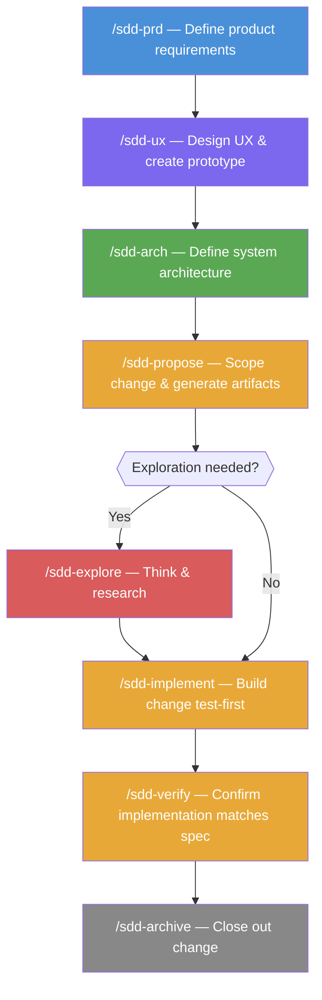

# sdd-team

`sdd-team` brings a full virtual software-development team into your editor. It provides four specialized agents and eight skills that collaborate through a **Specification-Driven Development (SDD)** workflow: ideas are captured in structured documents first, then implemented from those documents.

## Agents

Switch to an agent by typing `@agent-name` in the Copilot Chat panel.

| Agent | Handle | Role |
|---|---|---|
| Product Manager | `@pm` | PRD creation, requirements discovery, stakeholder alignment |
| System Architect | `@architect` | Architecture documentation, system design, trade-off analysis |
| Senior Software Engineer | `@dev` | TDD implementation, code review, story execution |
| Design Studio | `@ux-designer` | UX brainstorming, design decisions, HTML/CSS prototyping |

Each agent is a collaborative peer — it asks questions, presents options, and waits for your confirmation before proceeding.

---

## Skills (Slash Commands)

Skills are invoked as slash commands inside any agent conversation.

### Global project documents

These commands create or update the shared documents that all agents use as context.

| Command | Description | Output |
|---|---|---|
| `/sdd-prd` | Create or update the Product Requirements Document | `sdd-docs/prd.md` |
| `/sdd-ux` | Create or update the UX design document and HTML prototype | `sdd-docs/ux.md`, `sdd-docs/prototype-*.html` |
| `/sdd-arch` | Create or update the architecture document | `sdd-docs/architecture.md` |

### Change lifecycle

A *change* is a named, scoped unit of work (a feature, bug fix, or improvement). Changes live in `sdd-docs/changes/<name>/`.

| Command | Description |
|---|---|
| `/sdd-propose <name>` | Propose a change — creates `proposal.md`, `design.md`, and `tasks.md` |
| `/sdd-explore [topic]` | Enter explore mode for open-ended thinking; no code is written |
| `/sdd-implement [name]` | Implement the tasks for a change using TDD |
| `/sdd-verify [name]` | Verify that the implementation matches the change artifacts |
| `/sdd-archive [name]` | Archive a completed and verified change |

---

## SDD Workflow



```
1. /sdd-prd          → Define what the product does and why
2. /sdd-ux           → Define the user experience and create a prototype
3. /sdd-arch         → Define how the system is built
4. /sdd-propose      → Scope a change and generate implementation artifacts
5. /sdd-implement    → Build the change test-first
6. /sdd-verify       → Confirm the implementation matches the spec
7. /sdd-archive      → Close out the change
```

For small changes, `/sdd-propose` followed by `/sdd-implement` is often sufficient. For exploratory work, start with `/sdd-explore`.

---

## Document structure

All SDD documents are stored in a `sdd-docs/` directory at the root of your project:

```
sdd-docs/
├── prd.md                    # Product Requirements Document
├── ux.md                     # UX design document
├── architecture.md           # Architecture document
├── prototype-<project>.html  # Interactive HTML prototype
└── changes/
    ├── <change-name>/
    │   ├── proposal.md       # What & why
    │   ├── design.md         # How
    │   └── tasks.md          # Implementation steps
    └── archive/              # Completed changes
```

---

## Templates

Each skill that **generates** documents includes its own templates in a `templates/` subdirectory:

- **sdd-prd**: `prd.md` — template for the product requirements document
- **sdd-ux**: `ux.md` and `prototype-template.html` — templates for UX design and HTML prototype
- **sdd-arch**: `architecture.md` — template for the architecture document
- **sdd-propose**: `proposal.md`, `design.md` — templates for change proposals

Skills that only **read** documents (sdd-implement, sdd-explore, sdd-verify, sdd-archive) do not include templates.

The build process automatically includes these templates in the plugin distribution.

---

## VS Code Documentation

For more information on Agent Plugins, see the official VS Code documentation:  
https://code.visualstudio.com/docs/copilot/customization/agent-plugins
