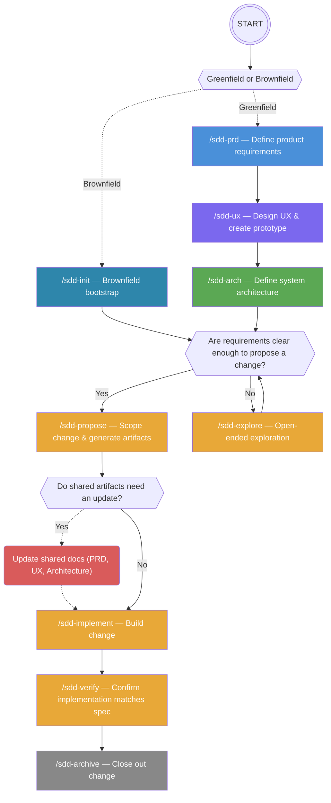

# sdd-team

`sdd-team` brings a full virtual software-development team into your editor. It provides four specialized agents and eight skills that collaborate through a **Specification-Driven Development (SDD)** workflow: ideas are captured in structured documents first, then implemented from those documents.

> [!NOTE] 
> This framework is inspired by **BMAD** and **OpenSpec**.

## Agents
Switch to an agent by typing `@agent-name` in the Copilot Chat panel.

| Agent | Handle | Role |
|---|---|---|
| Product Manager | `sdd-pm-agent` | PRD creation, requirements discovery, stakeholder alignment |
| System Architect | `sdd-architect-agent` | Architecture documentation, system design, trade-off analysis |
| Senior Software Engineer | `sdd-dev-agent` | TDD implementation, code review, story execution |
| Design Studio | `sdd-ux-designer-agent` | UX brainstorming, design decisions, HTML/CSS prototyping |

Each agent is a collaborative peer — it asks questions, presents options, and waits for your confirmation before proceeding.

---

## SDD Help & Reference

Use `/sdd-help` to explore the Specification-Driven Development (SDD) workflow and artifacts. The `sdd-help` skill provides a read-only reference with:

- an SDD overview and core principles
- the full process (project setup and change lifecycle)
- detailed artifact definitions (`prd.md`, `ux.md`, `architecture.md`, `proposal.md`, `design.md`, `tasks.md`, and `specs`)
- team roles and recommended agent usage
- the skills/commands reference and a "what's next" assessment

---

## Skills (Slash Commands)

Skills are invoked as slash commands inside any agent conversation. Suggested to use the appropriate agent for each skill, but you can also call any skill from any agent.

### Shared project documents

These commands create or update the shared documents that all agents use as context.

| Command | Description | Output | Suggested Agent |
|---|---|---|---|
| `/sdd-init` | **Brownfield only** — bootstrap all shared docs from an existing codebase in one pipeline | `{ARTIFACT_MAIN_FOLDER}/{SHARED_SUBFOLDER}/prd.md`, `architecture.md`, `ux.md` (if UI detected), `sdd-tracker.yml` | `sdd-pm-agent` |
| `/sdd-prd` | Create or update the Product Requirements Document | `{ARTIFACT_MAIN_FOLDER}/{SHARED_SUBFOLDER}/prd.md` | `sdd-pm-agent` |
| `/sdd-ux` | Create or update the UX design document and HTML prototype | `{ARTIFACT_MAIN_FOLDER}/{SHARED_SUBFOLDER}/ux.md`, `{ARTIFACT_MAIN_FOLDER}/{SHARED_SUBFOLDER}/prototype-*.html` | `sdd-ux-designer-agent` |
| `/sdd-arch` | Create or update the architecture document | `{ARTIFACT_MAIN_FOLDER}/{SHARED_SUBFOLDER}/architecture.md` | `sdd-architect-agent` |

### Change lifecycle

A *change* is a named, scoped unit of work (a feature, bug fix, or improvement). Changes live in `{ARTIFACT_MAIN_FOLDER}/{CHANGE_SUBFOLDER}/<name>/`.

| Command | Description | Output | Suggested Agent |
|---|---|---|---|
| `/sdd-propose <name>` | Propose a change — creates `proposal.md`, `design.md`, and `tasks.md` | `{ARTIFACT_MAIN_FOLDER}/{CHANGE_SUBFOLDER}/<name>/proposal.md`, `{ARTIFACT_MAIN_FOLDER}/{CHANGE_SUBFOLDER}/<name>/design.md`, `{ARTIFACT_MAIN_FOLDER}/{CHANGE_SUBFOLDER}/<name>/tasks.md` | `sdd-pm-agent` |
| `/sdd-explore [topic]` | Enter explore mode for open-ended thinking; no code is written | `-` | `-` |
| `/sdd-implement [name]` | Implement the tasks for a change using TDD | `implementation code & tests` | `sdd-dev-agent` |
| `/sdd-verify [name]` | Verify that the implementation matches the change artifacts | `-` | `-` |
| `/sdd-archive [name]` | Archive a completed and verified change | `{ARTIFACT_MAIN_FOLDER}/{CHANGE_SUBFOLDER}/<name>/archive/` | `-` |

---

## SDD Workflow



```
Greenfield project:
1. /sdd-prd          → Define what the product does and why
2. /sdd-ux           → Define the user experience and create a prototype
3. /sdd-arch         → Define how the system is built
4. /sdd-explore      → Explore requirements (Optional)
5. /sdd-propose      → Scope a change and generate implementation artifacts
6. /sdd-implement    → Build the change test-first
7. /sdd-verify       → Confirm the implementation matches the spec
8. /sdd-archive      → Close out the change

Brownfield project (existing code, no SDD docs yet):
1. /sdd-init         → Inspect codebase and bootstrap all shared docs in one pipeline
2. /sdd-explore      → Explore requirements (Optional)
3. /sdd-propose      → Scope your first change from the generated docs
   ...
```

For small changes, `/sdd-propose` followed by `/sdd-implement` is often sufficient. 
For exploratory work, start with `/sdd-explore`.

---

## Document structure

All SDD documents are stored in a `{ARTIFACT_MAIN_FOLDER}/` directory at the root of your project:

```
{ARTIFACT_MAIN_FOLDER}/
├── {SHARED_SUBFOLDER}/                        # Shared project documents
│   ├── prd.md                       # Product Requirements Document
│   ├── ux.md                        # UX design document
│   ├── architecture.md              # Architecture document
│   └── prototype-<project>.html     # Interactive HTML prototype
├── {SPECS_SUBFOLDER}/               # Shared capability registry
│   └── <capability>/
│       └── spec.md
└── {CHANGE_SUBFOLDER}/              # Changes
    ├── <change-name>/
    │   ├── {SPECS_SUBFOLDER}/       # Delta specs
    │   │   └── <capability>/
    │   │       └── spec.md
    │   ├── proposal.md
    │   ├── design.md
    │   └── tasks.md
    └── archive/                     # Completed changes
        └── YYYY-MM-DD-<change-name>/
```

---

## Configuration

The folder names are configurable. Edit [`config.json`](config.json) at the root of the plugin source before building:


| Variable |  Description |
|---|---|
| `ARTIFACT_MAIN_FOLDER`  | Root folder for all SDD documents |
| `SHARED_SUBFOLDER`  | Subfolder for shared documents (PRD, UX, Architecture, prototype) |
| `CHANGE_SUBFOLDER`  | Subfolder for change artifacts |
| `SPECS_SUBFOLDER`  | Name of the specs subfolder (shared registry and delta specs) |

After editing, run `npm run build` to regenerate the plugin with your custom paths.

---

## Tracker (SDD workflow tracker)

The SDD workflow tracker is an automatically-managed YAML file that provides a single source
of truth for the lifecycle and history of SDD artifacts. It is stored at:

{ARTIFACT_MAIN_FOLDER}/sdd-tracker.yml

Purpose:
- Track shared project documents (e.g. `shared/prd.md`, `shared/architecture.md`, `shared/ux.md` and the prototype)
- Track change lifecycle entries under `changes[]` (one item per `{CHANGE_SUBFOLDER}/<name>`)
- Maintain `created`, `lastUpdate`, and a short `changelog` for every artifact
- Record change `status` along the workflow: `ready-for-dev` → `in-progress` → `done` → `archived`

How it works:
- The tracker is auto-created from a template when first needed and is updated by the SDD skills
  (for example: `sdd-prd`, `sdd-ux`, `sdd-arch`, `sdd-propose`, `sdd-implement`, `sdd-archive`).
- Skills invoke the internal `sdd-tracker` logic to perform updates — users normally do not
  edit the file directly.

If you need to repair the tracker you can use the `sdd-tracker` skill.

## VS Code Documentation

For more information on Agent Plugins, see the official VS Code documentation:  
https://code.visualstudio.com/docs/copilot/customization/agent-plugins
